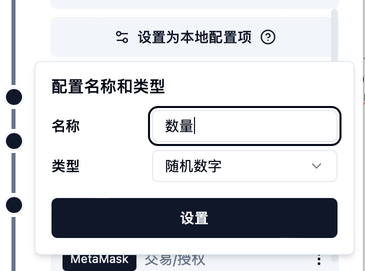
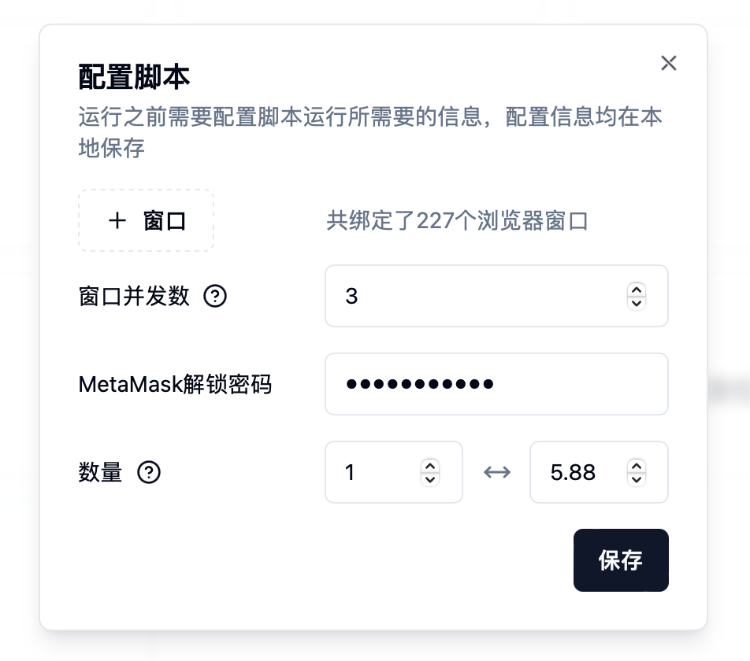

# ❓ 常见问题

> 我录制的脚本执行的时候某些步骤特别慢怎么回事？

慢是因为这个步骤前面的一个或多个选择器selector没有找到，这时系统会继续查找剩余的selector，这时你可以删除脚本中该步骤前面确认无效的选择器，来优化提高脚本执行速度。

> 我的代理IP速度不稳定，经常网页还没打开或者操作没完成就超时了？

你可以在设置--系统设置中将超时时间提高，比如设置为60。

> 我的脚本有些窗口可以成功，有些窗口不成功怎么回事？

这种情况大部分原因可能是这些浏览器窗口的系统语言不一致，导致某些选择器找不到，建议将所有指纹浏览器窗口都改为统一语言，例如英文。

> 我的指纹浏览器连上了，但是选择窗口的时候一直查询失败？

这很可能是你的全局代理导致的，请先关闭再试一下看是否成功，最后再打开继续重试看是否成功。

> 某些浏览器窗口突然打不开了，之前都好好的？

应该是你在指纹浏览器修改了分组或者进行了其他编辑操作，导致全局或者脚本的配置找不到了。

> 自动运行脚本的时候，我可以在其他应用输入吗？

当脚本没有输入操作的时候可以，有输入操作则不行，你只能抢焦点（即点击其他应用到前台查看），否则会导致脚本输入不正确导致失败。

> 我执行任务的过程中，在任务界面点击了暂停，但是没有暂停？

不是没有暂停，是在暂停的过程中，因为每个脚本都是由一个个步骤组成，暂停触发的时候可能当前步骤刚刚开始或者正在执行中，需要等待这个步骤执行完成，在下一个步骤开始之前完成暂停操作，请耐心等待即可。

> 操作网页的时候有机器人验证，怎么办？

可以在设置--系统设置中配置2Captcha API Key，配置完成之后可以自动解决机器人验证（目前只支持Cloudflare，更多正在支持中）。

> 定时任务失败了怎么回事？

请前往任务界面查看原因，可能是电脑息屏了，可能是开始时有任务在执行，可能是未开启指纹猎手客户端等等情况。

> 我想设置某一个范围内的随机数怎么设置？

当设置本地配置项的时候，类型选择随机数字：

<figure><figcaption></figcaption></figure>

然后在配置的时候输入起始和终止范围，最终随机数保留几位小数取决于起始和终止数字最大的小数位数，例如1到5.88，则结果可能为3.75，2到9，则结果可能为5。

<figure><figcaption></figcaption></figure>

> 绑定的窗口执行的时候顺序是怎么样的？

是随机的顺序，然后始终保持设置的窗口并发数打开执行，例如并发三个窗口，当其中一个窗口先执行完成，则会立即打开一个新窗口继续执行。
