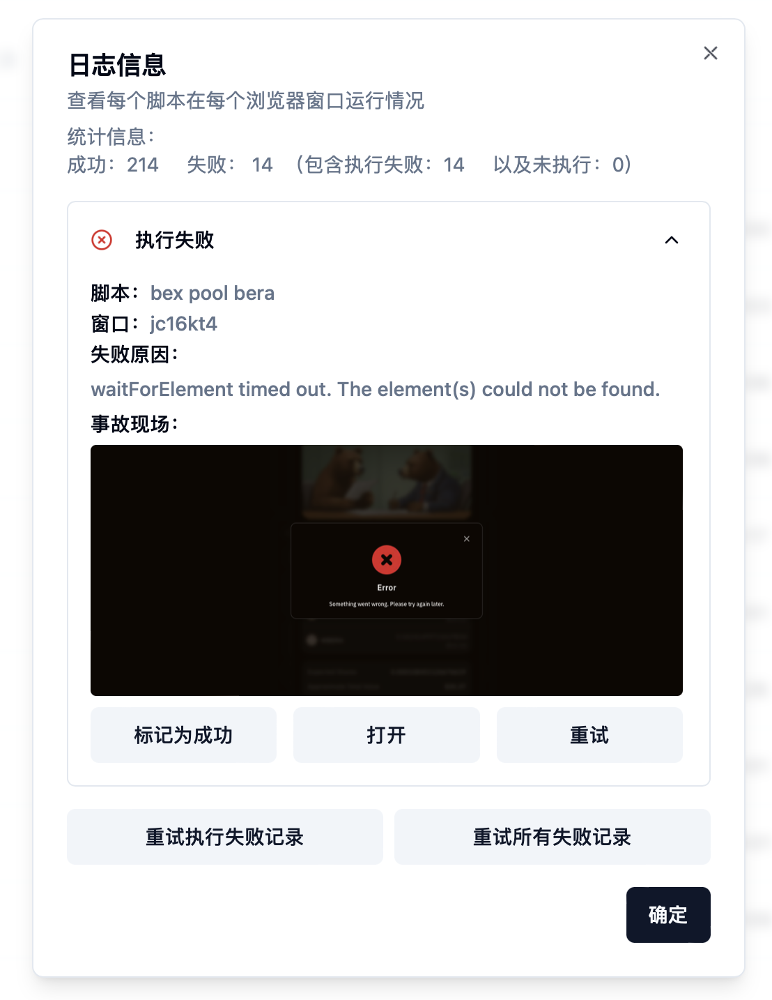
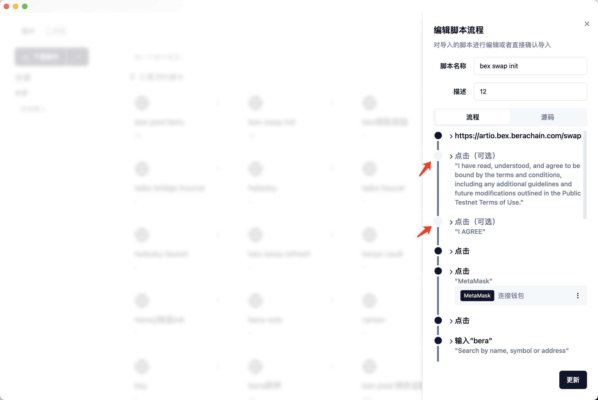

# 🛠️ 调试

### 概览


这部分内容需要部分前端知识，普通用户对于看不懂的内容可以略过


在我们录制脚本的时候最常遇到的错误就是找不到某个网页中的元素，这时我们需要在控制台进行验证，在脚本的每个步骤中都包含一个或多个选择器，selector或者XPath，指纹猎手会依次对这些选择器进行查找，如果第一个查找失败，这会继续查找第二个，如果所有选择器都没有找到，则会执行失败，抛出找不到某个元素的错误。

当执行失败的时候，我们可以在任务页面的历史记录中对日志信息进行查看，对于执行失败的记录，可以看到失败现场的截图信息，例如：

<figure><figcaption></figcaption></figure>

该条记录失败原因为元素未找到导致超时（点击图片可以放大查看），这时我们可以有以下选择：

1. 重试：点击该条记录下的重试按钮，会针对该条记录对应的脚本和窗口进行重试操作。
2. 打开：该操作会打开该条记录对应的窗口，由用户自己手动检查原因或者手动交互，最后可以手动将该条记录标记为成功。

如果该任务有执行失败或者未执行的记录，我们有以下选择：

1. 重试执行失败记录：点击该按钮会将所有的执行失败记录进行打包重试。
2. 重试所有失败记录：点击该按钮可以将所有执行失败记录以及未执行的记录一并进行打包重试。


当我们绑定的窗口较多，任务没有执行完成的时候，我们在任务的操作选项中点击了停止按钮，就会有剩余的未执行记录。


还有一种找不到元素的原因是第一次打开网页的时候有类似确认条款弹窗，以后打开都没有了，肯定会找不到弹框的确认按钮，这种情况我们该怎么处理呢？

我们可以在编辑脚本流程窗口中，点击该弹窗步骤前面的小黑点，将之标记为可选状态（再次点击可以清除状态），例如图示：

<figure><figcaption></figcaption></figure>

这样系统在找不到该步骤对应的selector时，会自动略过，继续执行下方非可选步骤。
