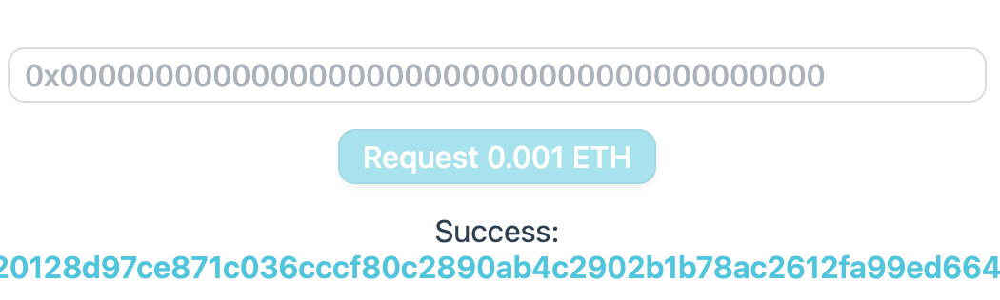
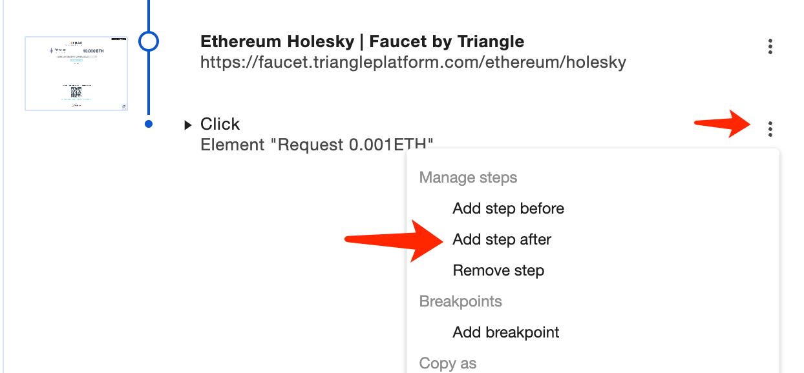
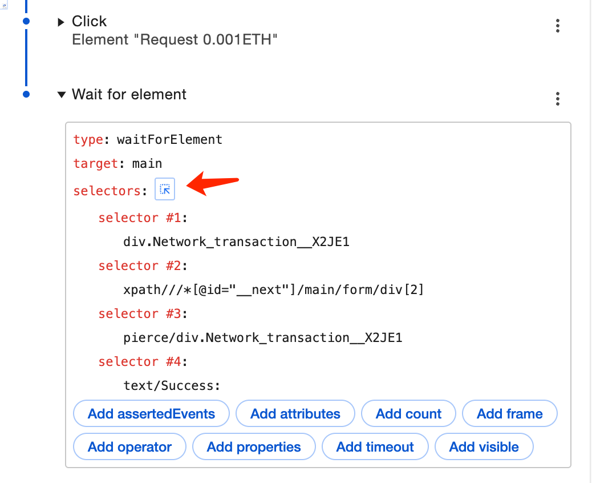
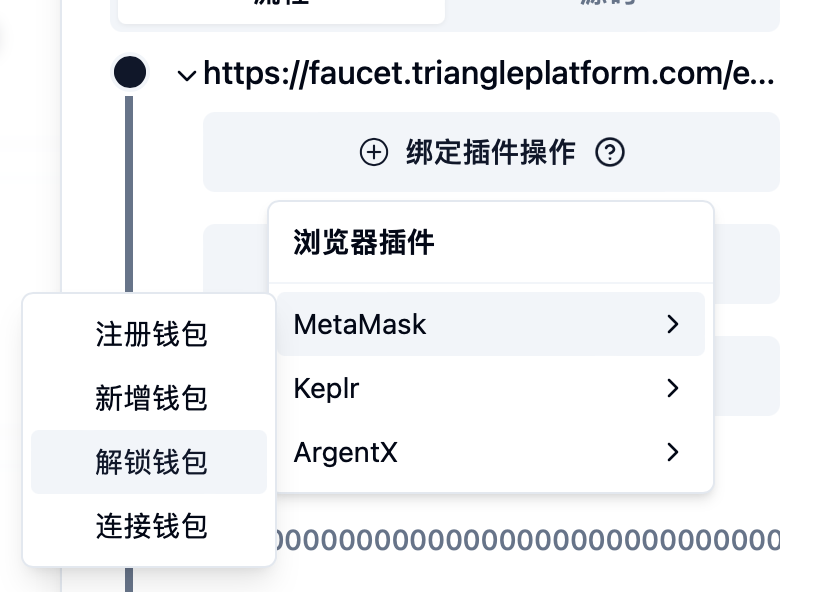
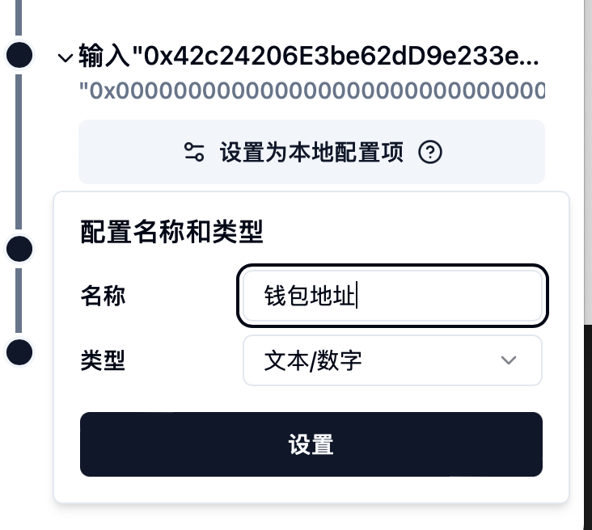
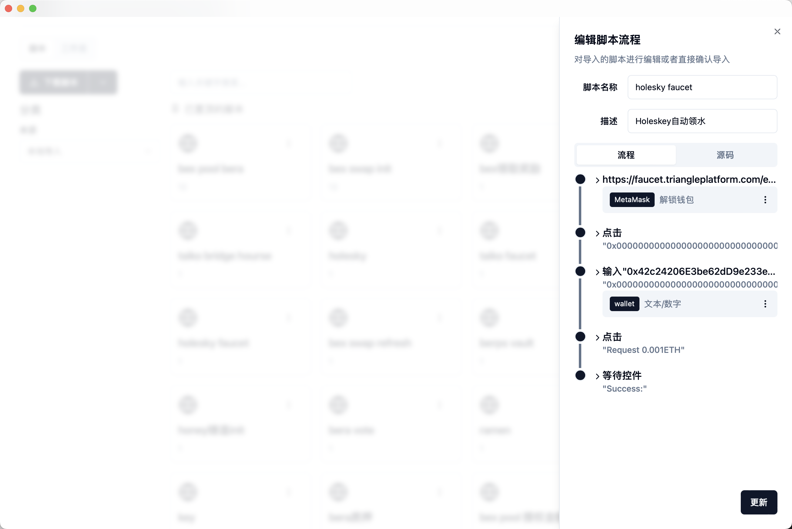
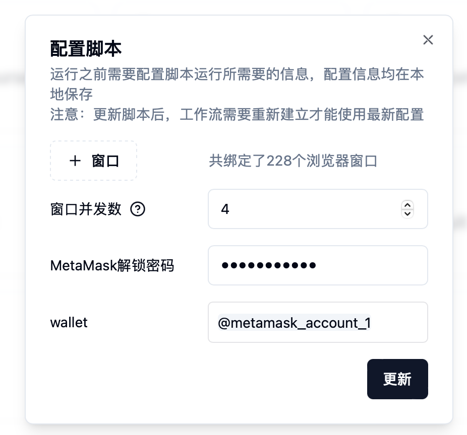

# 🚰 插件常量

### 概览

在入门的[工作流](../ru-men/gong-zuo-liu.md)一章中我们已经学习过了输出变量（电影名称）的引用，另外我们在交互各类网页的时候，不免会遇到输入钱包地址和代币数量的时候，指纹猎手提供了以下系统常量供输入进行配置：


常量在引用的时候需要输入&#x4E3A;**@\[常量名]\(常量名)**，方便与普通输入进行区分，即引用metamask\_account需要输&#x5165;**@\[metamask\_account]\(metamask\_account)**


#### 地址

* metamask\_account：当前钱包地址
* metamask\_account\_1：第一个钱包地址
* metamask\_account\_2：第二个钱包地址
* 以此类推

#### 余额

* metamask\_balance\_1：当前网络代币余额的一成（即10%）
* metamask\_balance\_2：当前网络代币余额的两成（即20%）
* 以此类推到10即metamask\_balance和metamask\_balance\_10都表示所有代币余额


注意：在引用以上变量的时候，需要先解锁或者连接钱包了才能正常引用


### 测试

接下来我们来完成一个Holesky测试网自动领水的脚本，打开谷歌浏览器前往[https://faucet.triangleplatform.com/ethereum/holesky](https://faucet.triangleplatform.com/ethereum/holesky)，然后右键Inspect找到录制器点击开始录制（详细步骤前往入门部分的[录制脚本](../ru-men/lu-zhi-jiao-ben.md)），然后依次点击网页输入框，粘贴你的钱包地址，然后点击Request 0.001ETH，等待提示成功：

<figure><figcaption></figcaption></figure>

为了防止录制一些不必要的操作，我们先停止录制，如果发现录制了不必要的操作，可以点击当前步骤的更多菜单中的删除按钮。

通常我们在录制脚本的时候，为了知晓脚本是否执行成功，都会在最后添加一步，即等待成功的标识出现，对于该脚本，则是需要等待Success或者交易的Tx出现，所以我们在录制器的最后一步的菜单中选择在后面添加一步：

<figure><figcaption></figcaption></figure>

type保持默认的waitForElement，然后点击selectors右边的选择按钮，再选择网页中的Success文字，这时录制器中的selectors会自动填充：

<figure><figcaption></figcaption></figure>

接着我们保存该脚本为JSON文件，导入到指纹猎手，开始对该脚本进行配置，首先我们引用钱包地址需要对钱包进行解锁，所以我们展开第一步网页地址，选择绑定插件操作中的MetaMask解锁钱包：

<figure><figcaption></figcaption></figure>

接下来在输入钱包地址步骤中展开，点击设置为本地配置项，配置好名称为wallet，类型为文本/数字：

<figure><figcaption></figcaption></figure>

最后的结果如下图所示，我们点击更新：

<figure><figcaption></figcaption></figure>

最后回到脚本配置窗口，在wallet输入框中输入@\[metamask\_account\_1]\(metamask\_account\_1)，即第一个钱包地址，输入会自动识别为引用格式的灰色背景：

<figure><figcaption></figcaption></figure>

最后点击更新保存，然后运行，可以看见我们绑定的窗口自动帮我们完成了领测试代币到钱包第一个地址的功能。
