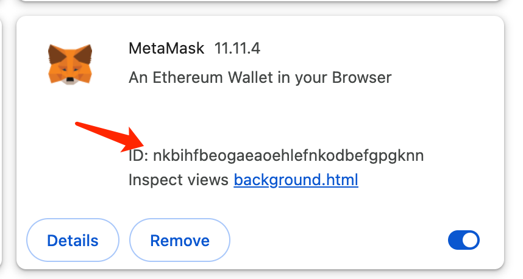
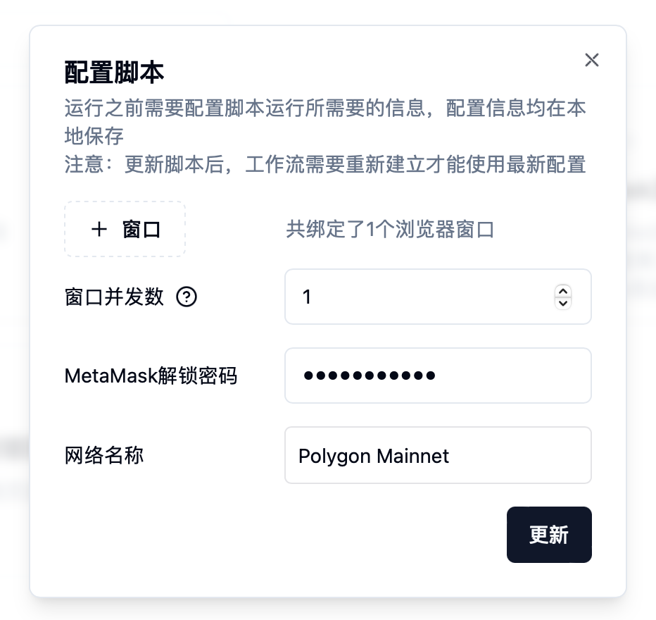
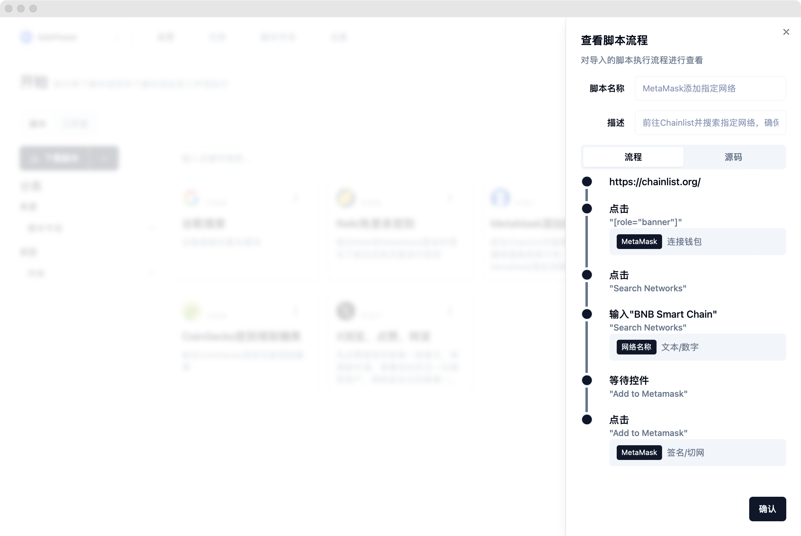

# 🤖 自动化插件

### 概览

目前指纹猎手完全支持MetaMask小狐狸插件和部分支持Keplr插件，后续会支持更多例如Phantom、ArgentX插件等，或者任意插件自动化。

### 第一步：配置插件ID

首先我们打开连接的指纹浏览器任意窗口，在地址栏输入并前往**chrome://extensions/**，可以看到当前浏览器安装的所有插件（如何在指纹浏览器安装插件在此略过），然后打开右上角的开发者模式，可以看到插件的ID：

<figure><figcaption></figcaption></figure>

复制该ID，然后前往指纹猎手设置，全局配置，对MetaMask插件ID进行配置，如果一样则无需配置（手动添加的插件，会与Chrome插件市场的ID不一致，试验下来AdsPower不一致，比特浏览器一致），然后顺带对MetaMask解锁密码进行配置（注：所有的单个脚本配置以及全局配置都保存在本地，不会进行云端存储）。

### 第二步：测试脚本

前往脚本市场，下载**MetaMask添加指定网络**插件，然后回到对该脚本进行配置，可以看到，由于我们全局配置了窗口、并发数和MetaMask解锁密码，所有我们只剩下网络名称还未配置，我们在网络名称中填写Polygon Mainnet （或者其他你的MetaMask还没有添加的网络）：

<figure><figcaption></figcaption></figure>

然后点击更新保存，再点击运行按钮，可以看到该浏览器上安装的小狐狸插件自动帮我们添加了Polygon主网网络。

这是怎么完成的呢？我们点击脚本更多菜单，选择查看，可以看到脚本流程我们添加了三步操作：

<figure><figcaption></figcaption></figure>

我们首先在网页中点击Connect Wallet的时候，为该点击操作添加了连接钱包操作，然后在网页输入框输入网络的时候把输入设置成了本地配置，即动态的网络名称，类型为文本/数字，最后在网页点击Add to Metamask（即添加网络到小狐狸）的时候，增加了小狐狸的签名操作，最后脚本完成所有流程。
