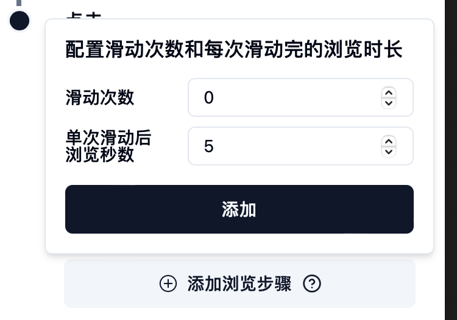

# ⛓️ 工作流

### 概览

工作流可以使多个脚本之前关联执行，当然也可以乱序执行，当我们在多个脚本有前后关系的时候非常实用，接下来我们利用上一章我们自己录制的豆瓣脚本来学习一下。

### 第一步：编辑脚本

找到我们之前导入的豆瓣脚本，单击更多菜单，然后点击编辑：

<figure><figcaption></figcaption></figure>

在弹出框流程中点击展开**点击“2010年代”**按钮，可以看到我们能为此操作增加一些效果，我们先点击添加浏览步骤，在单词滑动后浏览秒数输入框中输入5，然后点击添加：

<figure><figcaption></figcaption></figure>

此步骤的意思是点击完2010年代后，等待5秒钟，让网页完成分类工作，展示最新列表，接着我们点击绑定输出变量：

<figure><figcaption></figcaption></figure>

这步操作的意思是我们要在页面点击完成2010年代后，在当前页面提取一些我们需要的网页文本内容以供其他脚本使用，该范例中，我们需要得到该电影的名称，我们在弹框中填入变量名称为电影名称，选择器我们将在第二步填入。

### 第二步：查找选择器

在这个编辑脚本流程的步骤中，如果你需要输出变量（即上个步骤）和设置为列表批量操作，就需要对选择器有所了解，我们回到谷歌浏览器，在选择完成的电影列表中找到第一项：星际穿越，在星级穿越标题上方点击右键，**Inspect（检查）**来到我们前面熟悉的开发者工具：

<figure><figcaption></figcaption></figure>

将鼠标放在默认选择的HTML内容（上图右方）上，看左侧页面想要的内容即星际穿越四个字是否高亮，如果没有，可以点击开发者工具的选择元素按钮（**Elements**左侧第一个按钮），然后点击星际穿越，即可默认选中HTML元素。

接下来在选择的HTML元素上右键，选择Copy（复制）->Copy selector（复制选择器）即可。

然后我们回到指纹猎手，在选择器输入框中粘贴刚才的选择器，然后添加，可以看到我们对当前点击添加了两个操作：

<figure><figcaption></figcaption></figure>

最后确认更新编辑流程。

### 第三步：新建工作流

我们点击工作流选项卡，点击右侧的添加工作流，在弹窗中名称处填写工作流测试，然后点击添加脚本：

<figure><figcaption></figcaption></figure>

在脚本添加弹窗中，先选择豆瓣查询测试脚本，再选择谷歌搜索脚本（选择顺序决定了后续的输入变量引用，顺序执行模式下后选择的脚本可以引用前方选择的脚本）：

<figure><figcaption></figcaption></figure>

然后返回，将鼠标放在谷歌搜索脚本上悬浮，可以看见弹窗提示有可选输入配置：

<figure><figcaption></figcaption></figure>

我们点击修改输入配置，在弹窗中将默认的搜索内容进行修改，我们先输入@符号对前方脚本（即豆瓣脚本）的输出内容进行引用，然后再追加在线观看：

<figure><figcaption></figcaption></figure>

最后点击更新，设置好绑定的窗口和并发数，默认保持顺序执行，点击添加。

最后点击脚本运行快捷方式，即可看到在指定窗口依次运行了两个脚本，最后在谷歌中搜索了星际穿越 在线观看的结果。
