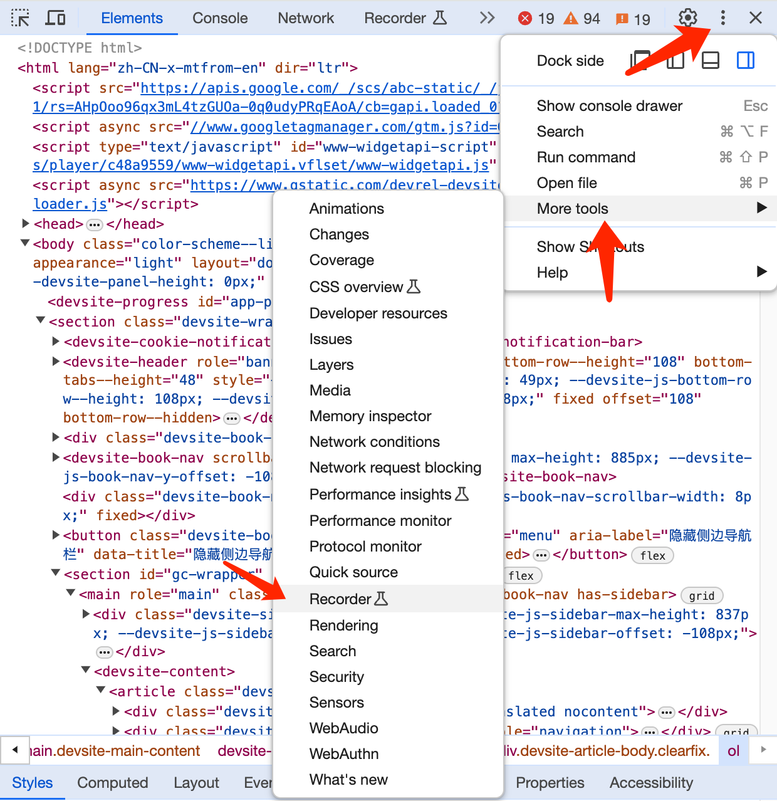
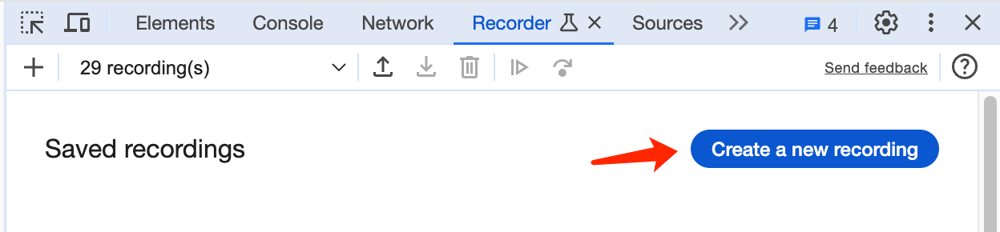
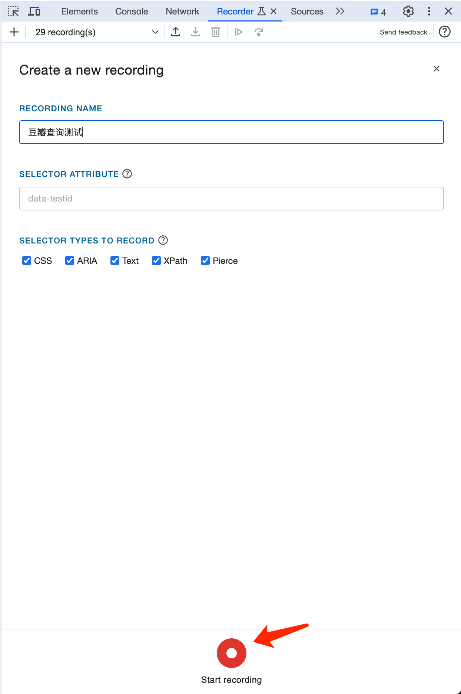
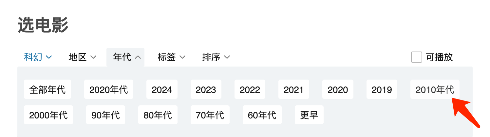
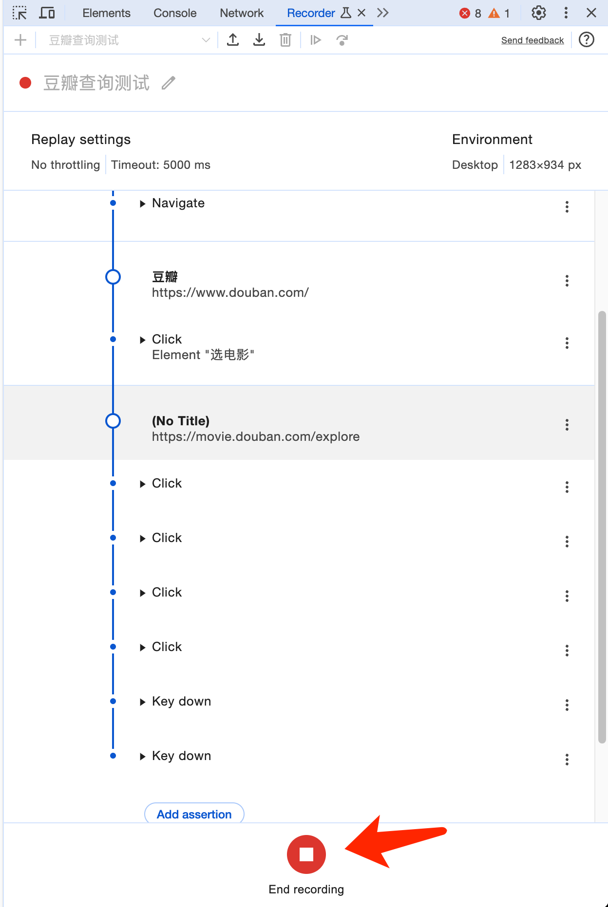
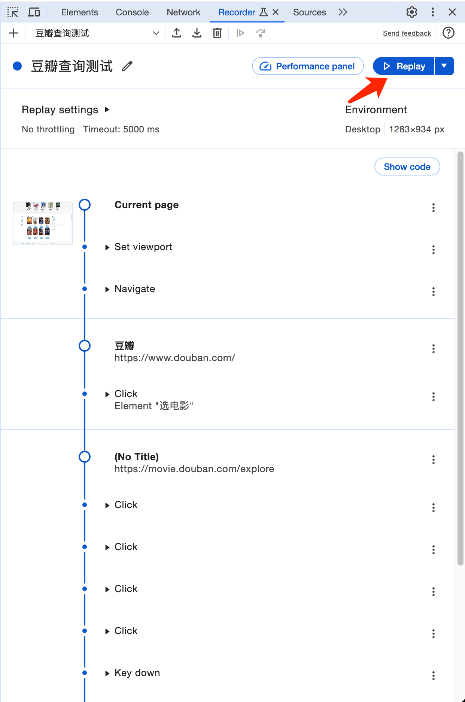
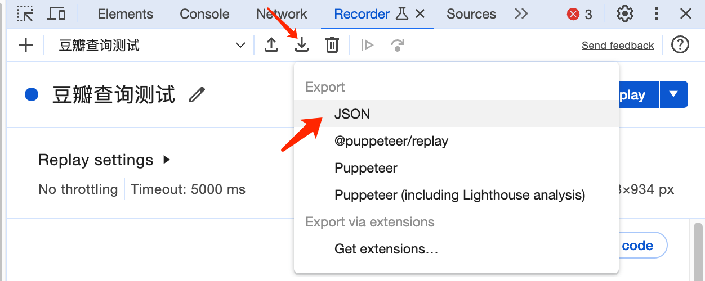
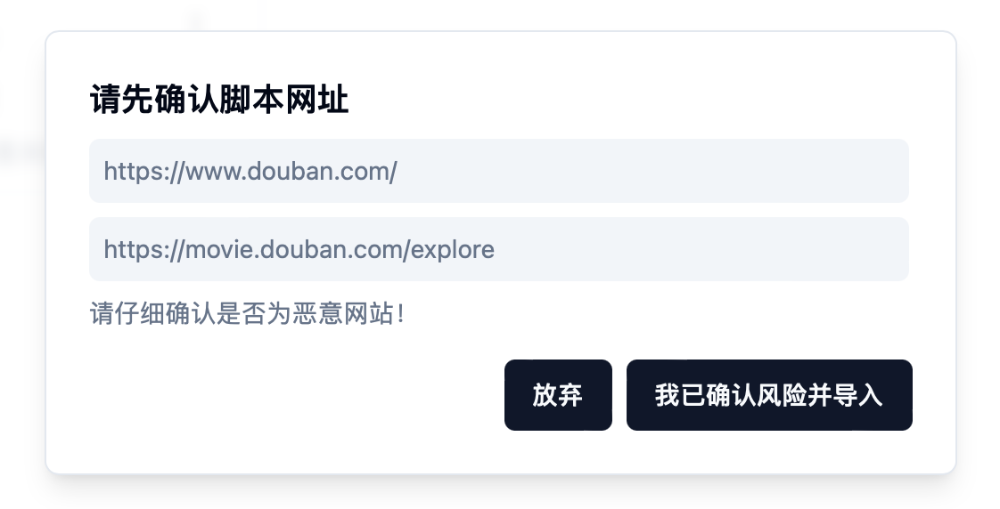
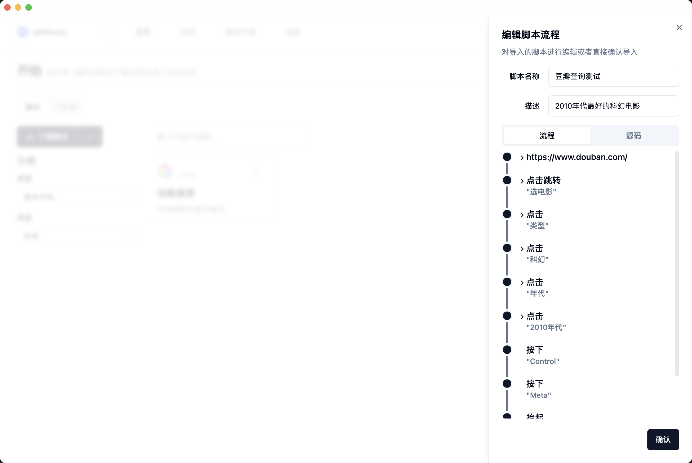
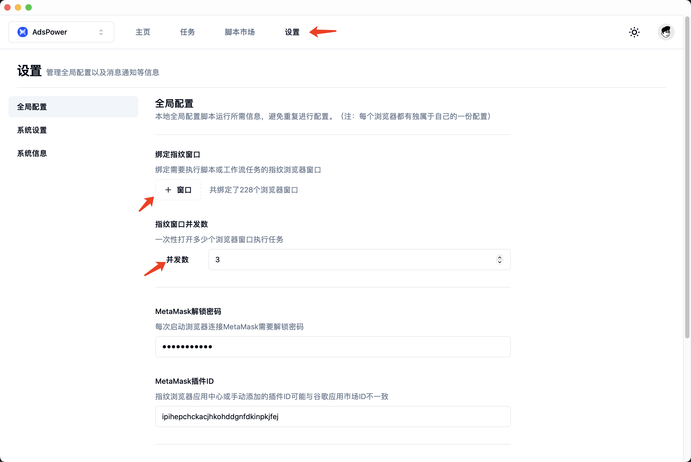

# ✨ 录制脚本

### 概览

脚本市场中的脚本是远远不能满足个人需求的，因此我们需要录制自己的脚本进行导入。

录制专属于自己的脚本几乎不需要代码知识（当然有的话会更加轻车熟路），且通常一个脚本只需要不到10分钟即可完成，接下来大家跟着我的步骤一步步操作，来录制一个简单的脚本。

### 第一步：认识录制器

打开安装的谷歌浏览器，我们前往[https://www.douban.com/](https://www.douban.com/)，同时我们的脚本需求是找到2010年代评分最好的科幻电影。

在豆瓣首页点击右键，选择最后一项**Inspect（检查）** ，然后会打开谷歌浏览器的开发者工具，开发者工具会默认打开 **Elements** 面板，然后根据下图从上到下依次选择**更多选项、更多工具、录制器**：

<figure><figcaption></figcaption></figure>

在打开的录制器工具中，我们点击新建录制：

<figure><figcaption></figcaption></figure>

脚本名称我们填写豆瓣查询测试，然后点击开始录制：

<figure><figcaption></figcaption></figure>

接下来我们依次根据下列图示进行点击（选电影->类型（科幻）->年代（2010年代））：

<figure><figcaption></figcaption></figure>

<figure><figcaption></figcaption></figure>

<figure><figcaption></figcaption></figure>

最后在开发者工具点击结束录制即可：

<figure><figcaption></figcaption></figure>

不到五分钟，我们就完成了我们的第一个自己的专属脚本，接下来我们就先来试试脚本能否正常工作吧！点击重放按钮：

<figure><figcaption></figcaption></figure>

如果没有意外的话，可以看见谷歌浏览器帮我们自动完成了刚才的一系列操作。

### 第二步：导入指纹猎手

在谷歌浏览器工作没问题之后，我们选择导出，一次选择导出->JSON格式，然后保存到电脑：

<figure><figcaption></figcaption></figure>

然后打开我们的指纹猎手，在主页下载脚本右侧点击箭头，导入脚本，选择刚才导出的脚本并确定导入：

<figure><figcaption></figcaption></figure>

<figure><figcaption></figcaption></figure>

导入后会自动打开脚本编辑流程页面，我们填写描述：查找2010年代最好的科幻电影，然后点击确定：

<figure><figcaption></figcaption></figure>

然后根据引导前往分类->本地导入，即可看到我们刚刚导入的豆瓣查询测试脚本，我们发现还需要再次配置窗口和并发数，为了防止我们每次都要对脚本进行配置窗口和并发数，我们先前往设置，点击指纹猎手顶部设置菜单：

<figure><figcaption></figcaption></figure>

我们对当前选择的指纹浏览器进行全局配置，配置好绑定的窗口和并发数后，点击最下方的更新配置即可。然后回到主页，找到刚才导入的脚本，已经变成了可直接运行的状态，点击运行即可在指定窗口自动运行。

最后，你可以前往[https://developer.chrome.com/docs/devtools/recorder?hl=zh-cn](https://developer.chrome.com/docs/devtools/recorder?hl=zh-cn)关于录制器的说明与技巧。
