# 💡 使用流程

### 概览

当注册并登录成功后，首先看到的是我们的主页面：

<figure>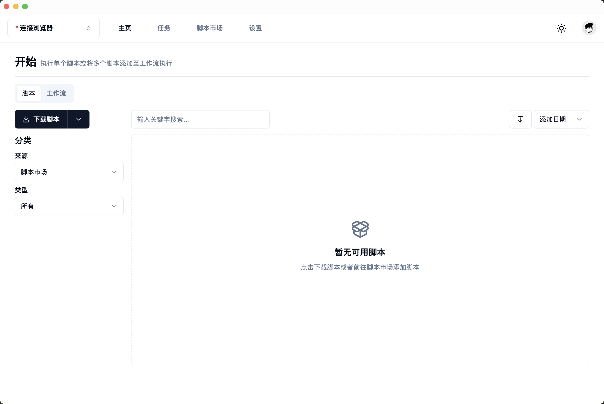<figcaption></figcaption></figure>

能看到顶部有[连接浏览器](shi-yong-liu-cheng.md#di-yi-bu-lian-jie-liu-lan-qi)以及四个分栏页：主页、任务、脚本市场和设置，以及右侧的白天/黑夜主题切换按钮和个人信息弹窗按钮，当前默认选中主页，主页有脚本以及工作流两个分栏，默认选中脚本，左侧可以选择脚本的分类，右边则是筛选后的脚本列表，同时可以对这些脚本进行搜索和排序。

### 第一步：连接浏览器

点击左上角连接浏览器，则会弹出浏览器选择弹窗：

<figure>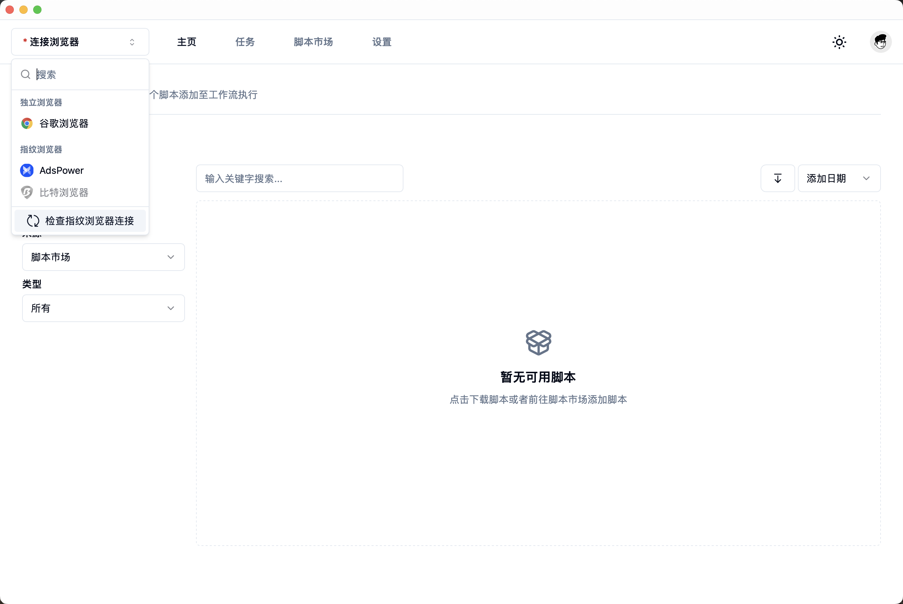<figcaption></figcaption></figure>

#### 连接指纹浏览器

可以看到，有独立的谷歌浏览器和三款最常用的指纹浏览器（AdsPower和比特浏览器以及MoreLogin指纹浏览器），弹出时会默认点亮已经开启的指纹浏览器客户端，并且需要该客户端已经开启了API功能以及默认的API端口（AdsPower API功能需要付费，默认端口50325，比特浏览器不需要，默认端口54345，MoreLogin限时体验，默认端口40000），如果还没有开启指纹浏览器，则需要打开后点击检查指纹浏览器连接按钮进行刷新，接下来点击任意已经点亮的客户端则可以正常连接。

#### 连接谷歌浏览器

无论是MacOS还是Windows操作系统，如果已经打开了Chrome浏览器，请先彻底退出（MacOS：Cmd+Q）Chrome浏览器，然后再点击指纹猎手中点亮的Chrome图标，等待指纹猎手自动打开Chrome，打开后则自动连接成功。

### 第二步：下载脚本

点击主页的下载脚本按钮，或者顶部的脚本市场按钮，进入脚本市场页面：

<figure>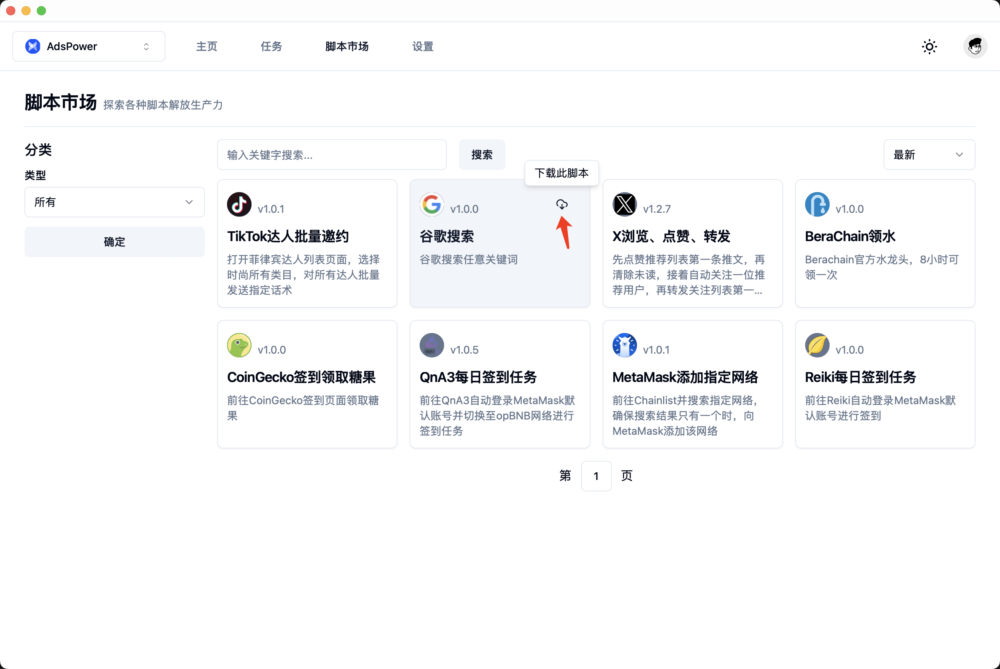<figcaption></figcaption></figure>

点击谷歌搜索脚本右上方的小云朵图标进行快捷下载，或者点击脚本在弹窗详情中点击下载：

<figure>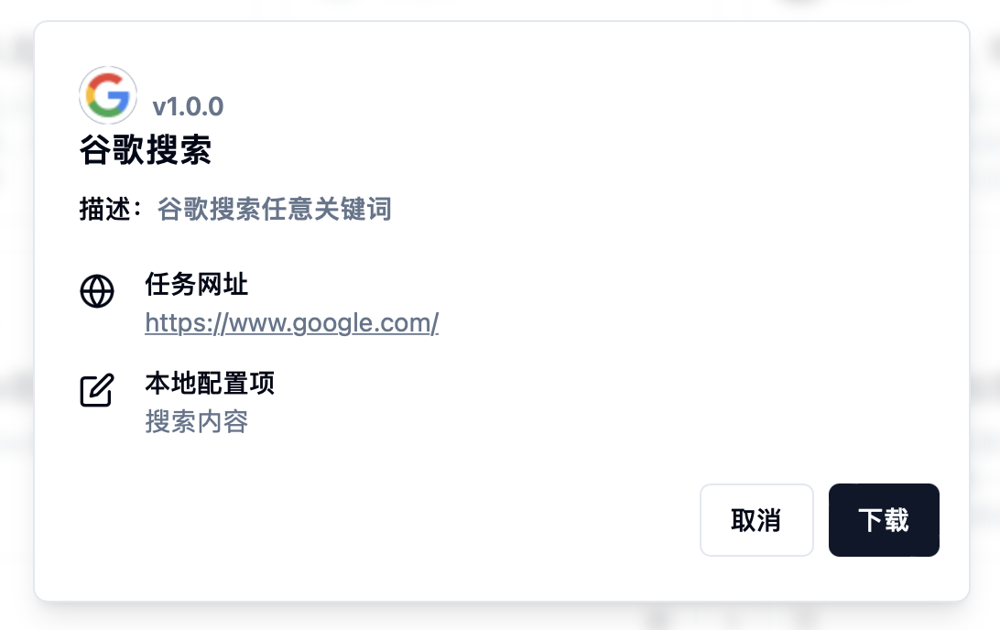<figcaption></figcaption></figure>

### 第三步：配置脚本（可选）

点击下载后根据引导返回主页，即可在页面看到脚本列表的谷歌搜索脚本：

<figure>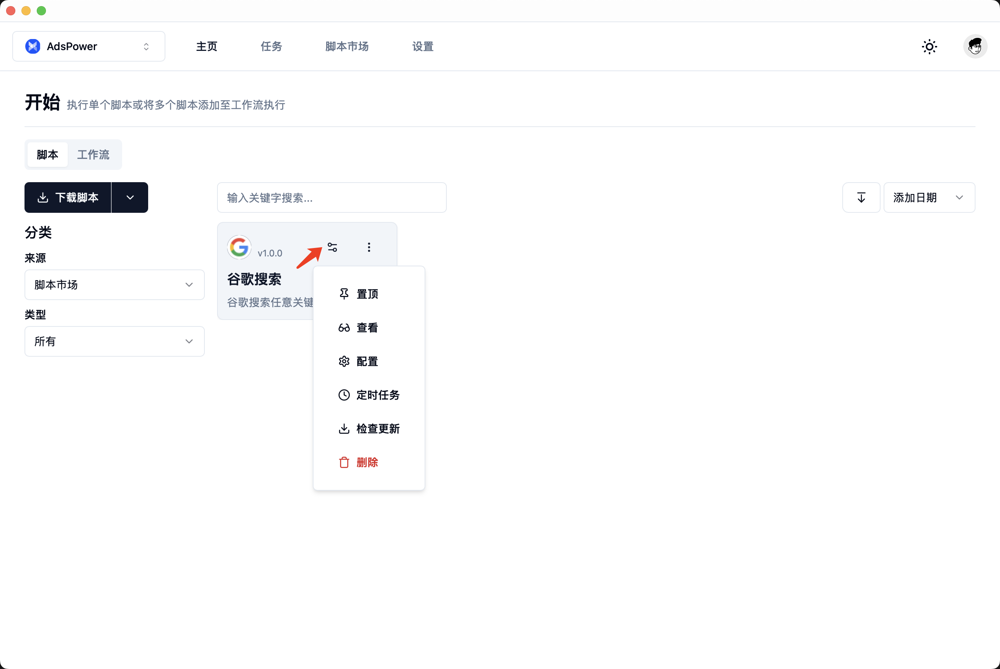<figcaption></figcaption></figure>

在配置之前，我们可以在菜单中点击查看可以查看该脚本的执行流程和源码：

<figure>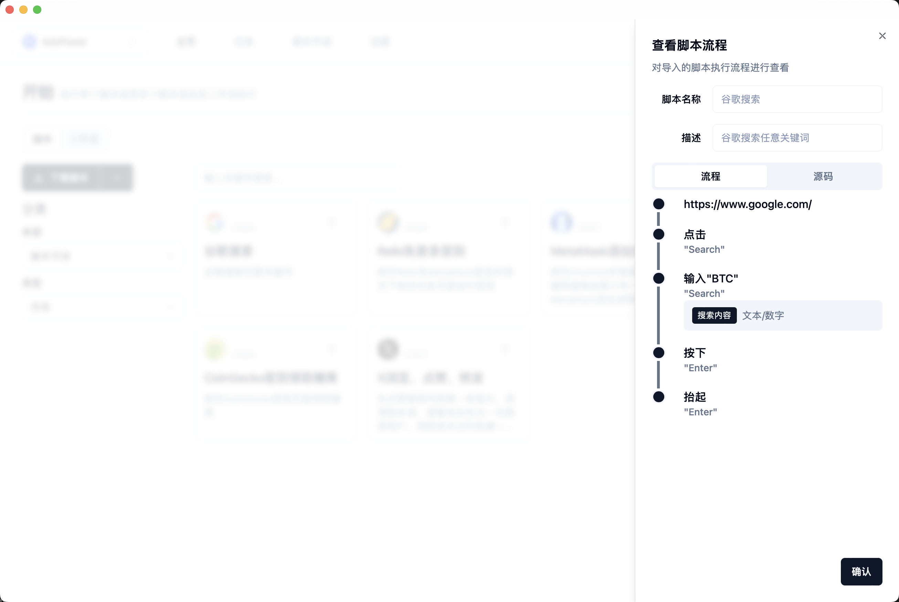<figcaption></figcaption></figure>

点击源码可以对脚本源码进行查看：

<figure>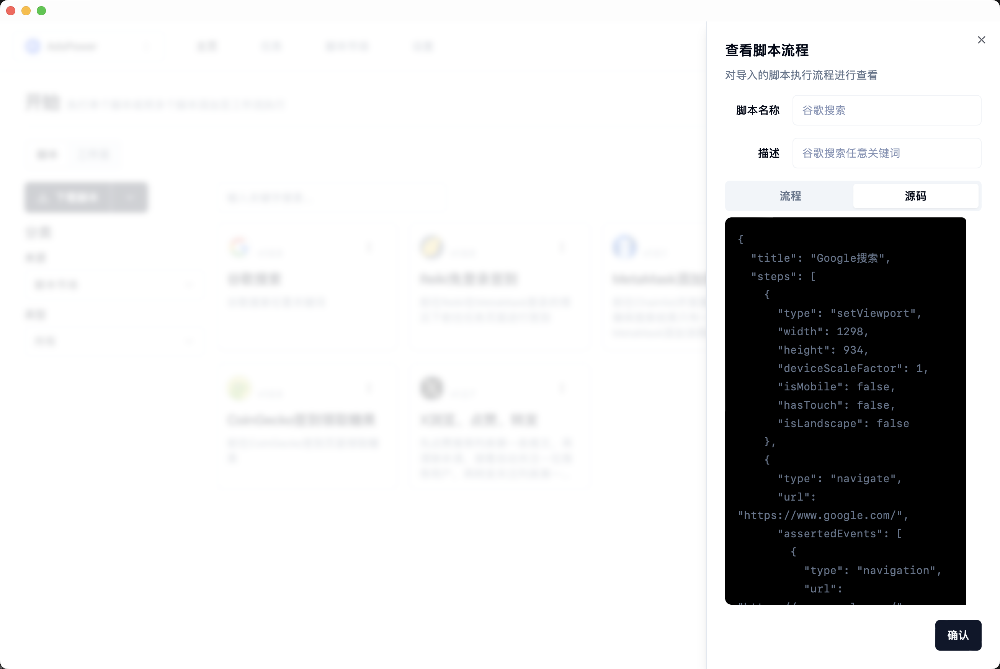<figcaption></figcaption></figure>

此脚本需要我们对搜索内容进行配置，点击快捷配置按钮或者点击菜单中的配置按钮，对脚本进行配置：

<figure>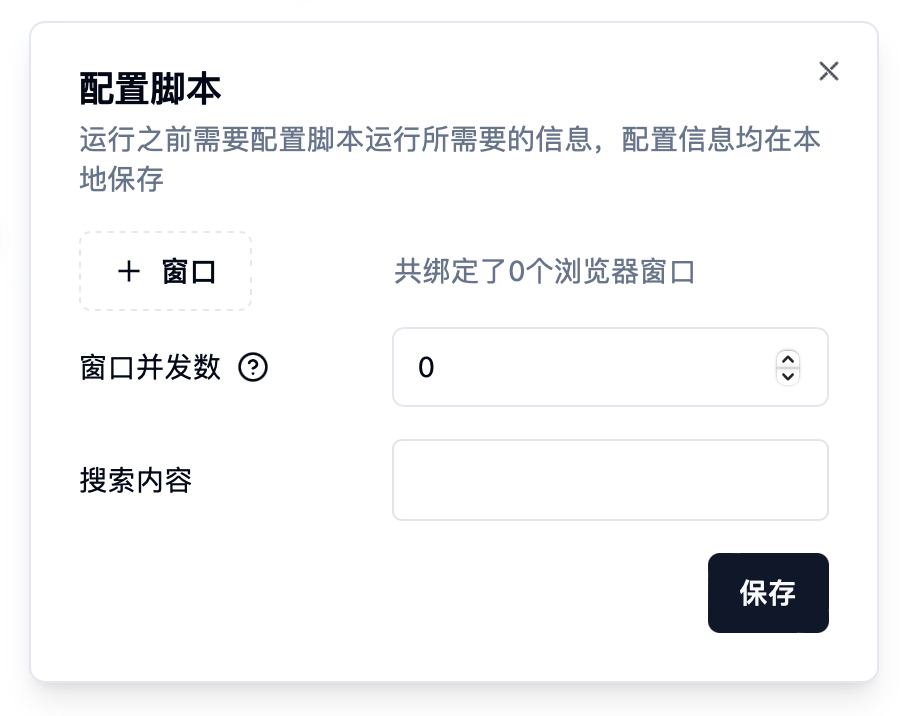<figcaption></figcaption></figure>

点击添加窗口按钮，在弹窗中选择要运行此脚本的指纹浏览器窗口（独立谷歌浏览器无需配置）：

<figure>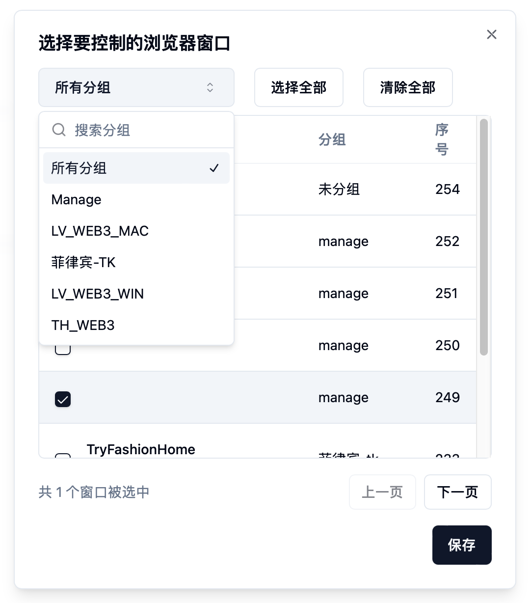<figcaption></figcaption></figure>

选中并保存后，设置窗口并发数（同时运行的最大浏览器窗口数量），此刻我们只绑定了一个窗口，设置1即可，接下来配置好搜索内容：ETH（或者你希望搜索的内容），点击保存。

### 第四步：运行脚本

<figure>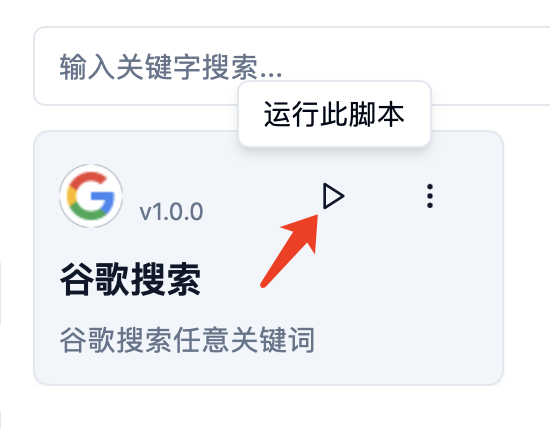<figcaption></figcaption></figure>

点击运行脚本快捷按钮，或者在弹出的详情中点击运行按钮，则会在选择的指纹浏览器窗口立即运行该脚本。

当任务执行完成后，会自动退出指纹浏览器窗口，然后根据引导前往任务页面：

<figure>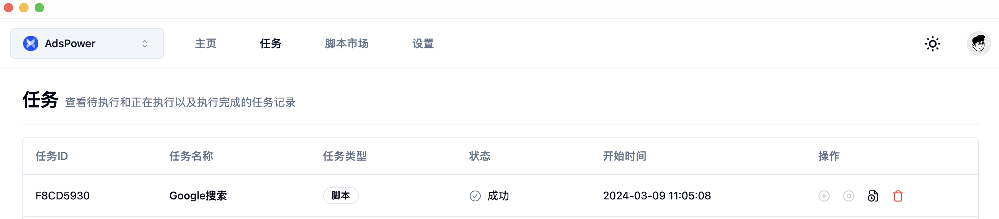<figcaption></figcaption></figure>

可以看到我们执行的脚本记录，状态为成功，点击操作中的日志信息按钮，则可以查看详细的日志记录：

<figure>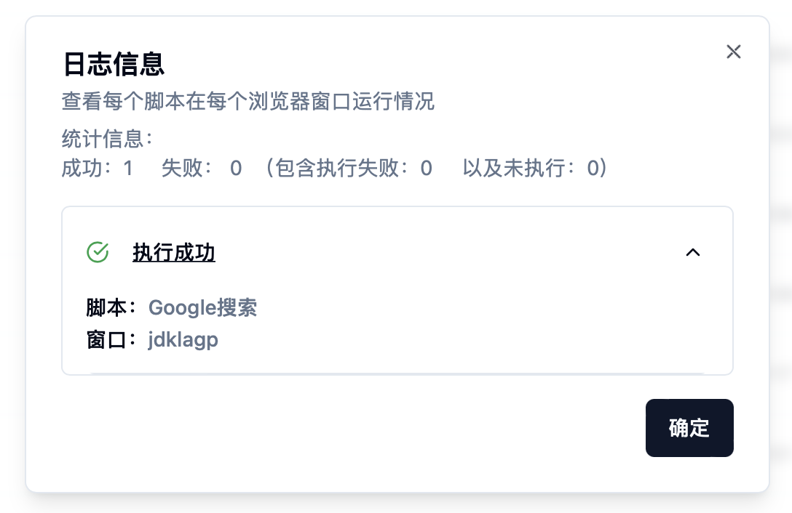<figcaption></figcaption></figure>

